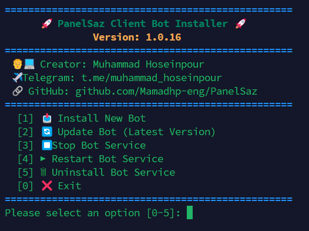

# PanelSaz
ربات پنل ساز با قابلیت اتصال به پنل پاسارگاد توانایی ساخت ادمین فروش به صورت خودکار را دارد
# 🚀 Pasarguard Panel Bot (Client Edition)
نسخه حرفه‌ای و اختصاصی ربات مدیریت پنل پاسارگاد. 
این ربات به صورت یکپارچه و بهینه برای مدیریت آسان کاربران، فروش حجم و تمدید سرویس‌ها در سرورهای لینوکسی طراحی شده و توسط سیستم لایسنس آفلاین محافظت می‌شود.

## 🌟 ویژگی‌های کلیدی
- نصب تک‌خطی: نصب و استقرار کامل ربات تنها با اجرای یک خط کد در ترمینال.
- مستقل و ایزوله: عدم نیاز به نصب پایتون و پیش‌نیازهای سنگین روی سرور اصلی.
- پایداری بالا: اجرای خودکار در پس‌زمینه (Systemd) و راه‌اندازی مجدد در صورت ری‌استارت سرور.
- امنیت لایسنس: سیستم تایید لایسنس آفلاین و رمزنگاری شده پیشرفته با طراحی منحصر به فرد
- قابلیت های منحصر به فرد(افزودن و مدیریت ادمین-تعین پلن های فروش ثابت و پرداخت در ازای مصرف و ... 
- تهیه لایسنس از ربات اصلی https://t.me/Panel_SazRobot
---

## 🛠 آموزش نصب سریع
برای نصب ربات روی سرور (اوبونتو / دبیان)، نیازی به دانش فنی پیچیده نیست. فقط کافیست دستور زیر را کپی کرده و در ترمینال سرور خود اجرا کنید:

```bash
bash <(curl -Ls https://raw.githubusercontent.com/Mamadhp-eng/PanelSaz/main/install.sh)
```

<p align="center">
  
</p>
